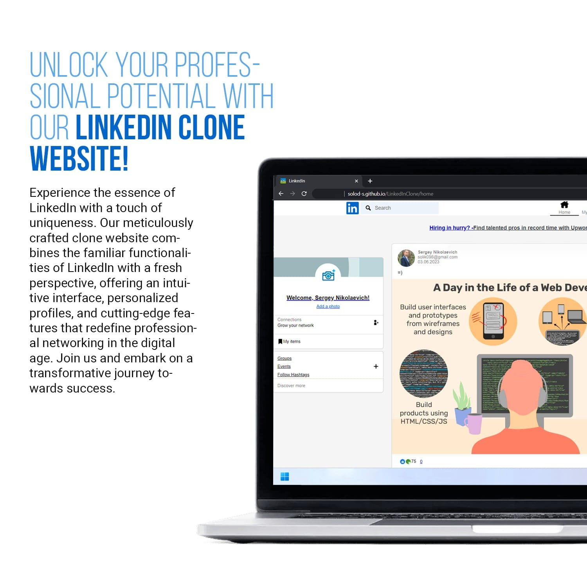
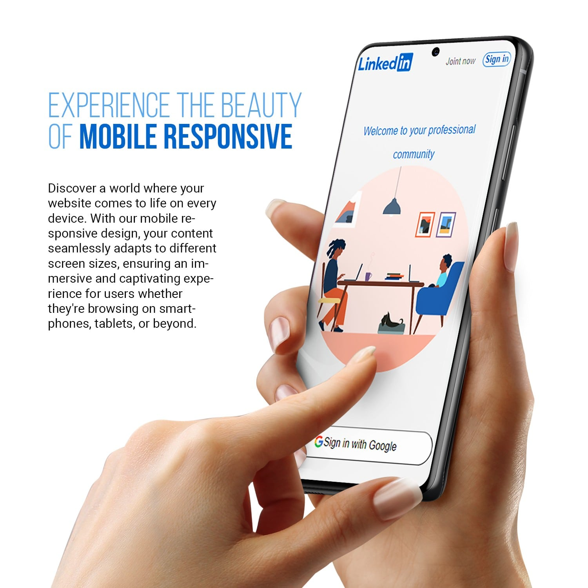
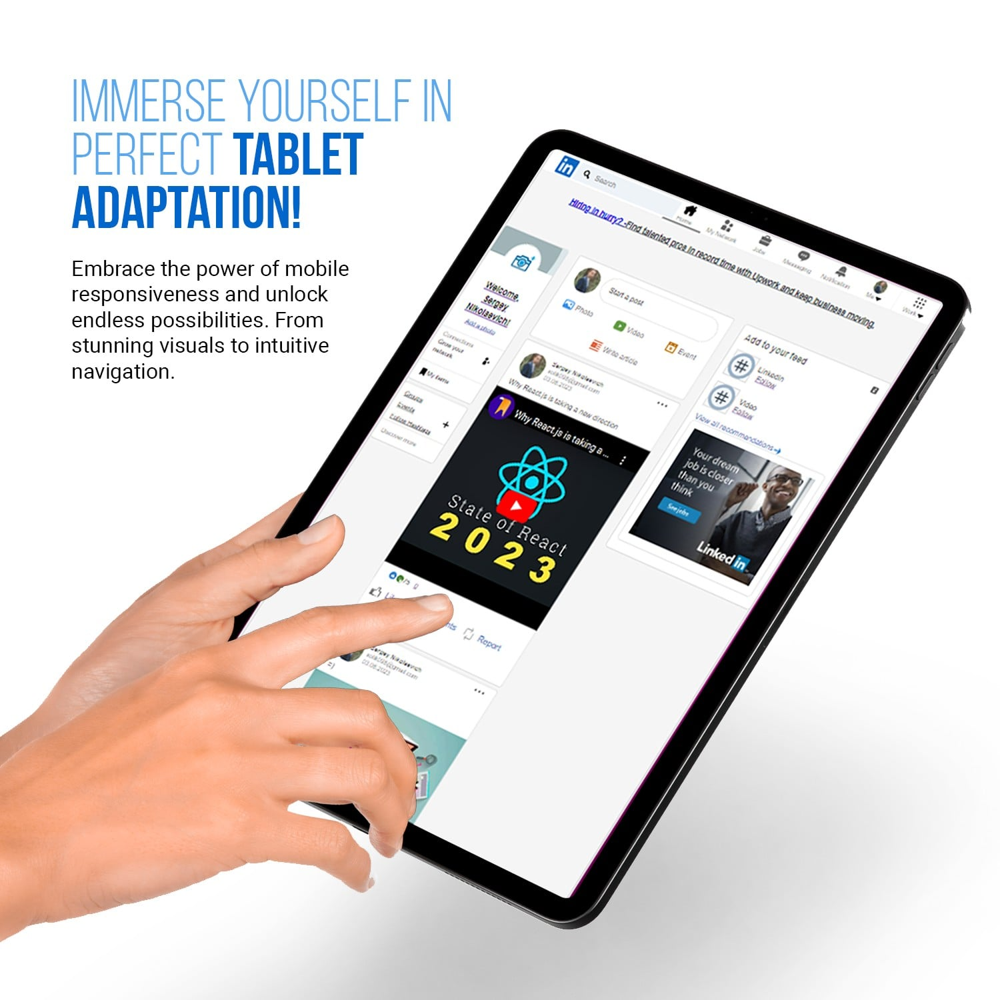

[](https://opensource.org/licenses/MIT)
[](https://uk.legacy.reactjs.org/)
[](https://reactrouter.com/en/main)
[](https://redux.js.org/)
[](https://firebase.google.com/)



# LinkedIn Clone



**_Built using React JS, Redux, Firebase & Styled-Components_**. It's created with help of the tutorial on YouTube by _'Clever Programmer'_. Added some features apart from the tutorial on my own like:

- Post like functionality
- Mobile responsiveness



## Features and Fuctionality


- Login using Google (Firebase Authentication)
- Create a new post
- Share photos and videos (React player for videos)
- Auto authenticate user on refresh
- Sign Out

## How to build your own..?

1. Clone this repo
1. Install all the dependencies
   ```bash
   npm i
   ```
1. Setup Firebase

   - Create Firebase account
   - Create a new project
   - Create a web app for that
   - Copy your config from there

     - Select config option
     - Paste those config inside src/fBase/fBase.js file

   - Setup authentication using Google

## Future Plans

- Write a backend (nod js/express/mongoDB) and attach it to this draft
- Make it on Redux Toolkit
- Add more login methods
- Post deleting functionality
- Add post's comments
- Add post's/comment's likes
- Add favorites
- Add user profile page
- Add company page
- Add jobs page

## Contributing

Contributions are welcome! If you have any suggestions or improvements, please create a pull request. For major changes, please open an issue first to discuss the changes.

**_NOTE: PLEASE LET ME KNOW IF YOU DISCOVERED ANY BUG OR YOU HAVE ANY SUGGESTIONS_**
